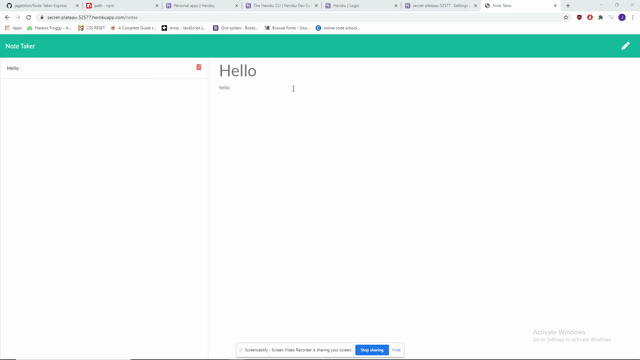

# Note Taker
   
  
  Check out the badges hosted by [shields.io](https://shields.io/).
  
  
  ## Description 
  
  
  My project was to create a note taking application that allows a user to create and save notes.

  
  ## Installation
  
  *Steps required to install project and how to get the development environment running:*
  
  After cloning the repoository run npm install to install all dependencies.
  

  ## Demonstration

  